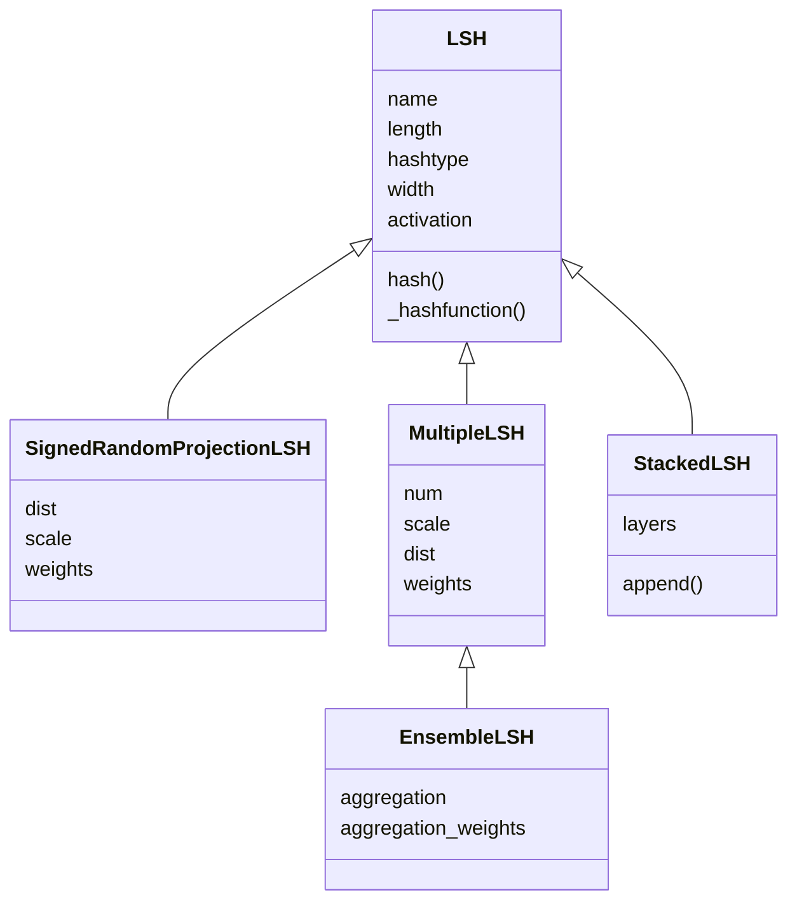

# ts-lsh - Locality Sensitive Hashing based embedings for High Dimensional Multivariate Time Series

```mermaid
classDiagram
    LSH : name
    LSH : length
    LSH : hashtype
    LSH : width
    LSH : activation
    LSH : hash()
    LSH : _hashfunction()
    LSH <|-- SignedRandomProjectionLSH
    SignedRandomProjectionLSH : dist
    SignedRandomProjectionLSH : scale
    SignedRandomProjectionLSH : weights
    LSH <|-- MultipleLSH
    MultipleLSH : num
    MultipleLSH : scale
    MultipleLSH : dist
    MultipleLSH : weights
    MultipleLSH <|-- EnsembleLSH
    EnsembleLSH : aggregation
    EnsembleLSH : aggregation_weights
    LSH <|-- StackedLSH
    StackedLSH : layers
    StackedLSH : append()
```
